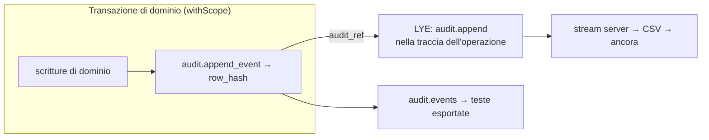
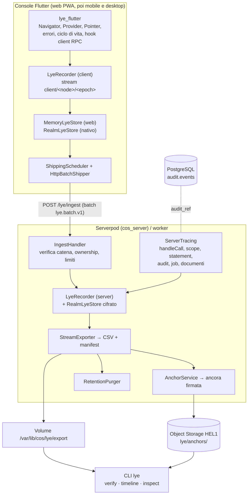
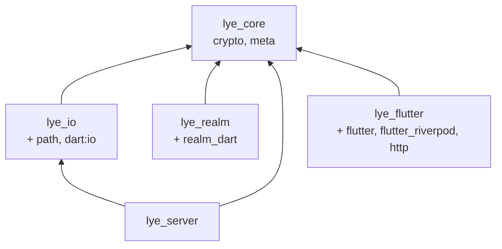
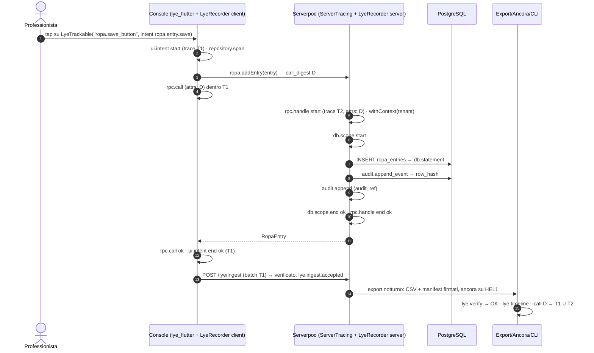

# Log Your Event (LYE) — Documento Tecnico di Progettazione

**Versione** 0.1.0 · **Data** 5 settembre 2026 · **Autore** Cristian Perciun · **Stato** bozza per revisione · **Repository** `log-your-event` (cartella sorella di `compliance-os`) · **Fonti di verità** `Compliance_OS_Documento_Tecnico_Architettura5.1.md` (di seguito **DTA**) e `Concept_Aziendale_SRL_Moldova5.1.md` (di seguito **CA**), entrambi in `compliance-os/docs/`.

## Sintesi esecutiva

**Cosa è.** LYE è la libreria proprietaria di Compliance OS che registra ogni azione — sulla console Flutter e sul server Dart — in *stream* di eventi concatenati con hash SHA-256, li conserva in uno store locale (Realm) e li esporta in **file CSV** con manifest firmati, verificabili da terzi senza accesso al database. Da quei file si ricostruisce **l'intero ciclo di un'operazione**: il gesto sulla console, la chiamata RPC, la transazione con scope RLS, ogni statement SQL, l'evento di audit, il job, l'esito. È un progetto separato, versionato con tag SemVer e incluso nei prodotti come dipendenza Git.

**Cosa non è.** Non sostituisce l'audit log `audit.events` (DTA §5.6), che resta l'artefatto probatorio delle mutazioni di dominio scritto nella stessa transazione. LYE è il tracciato tecnico-operativo completo che gli sta intorno e vi si collega riga per riga (`audit_ref`).

**Le decisioni** (ADR 001–007 in `docs/adr/`): cinque pacchetti con il cuore in Dart puro; Realm dietro l'interfaccia `LyeStore`, con store in memoria sul web; nessuna dipendenza da Serverpod; CSV `lye.v1` come formato canonico; hash-chain per stream costruita esattamente come `audit.canonical_event_v1`; propagazione del contesto via `Zone` e correlazione client–server con `call_digest`; minimizzazione by design; distribuzione via tag Git.

**Stato.** La v0.1.0 è implementata e verificata: 5 pacchetti, analisi statica stretta pulita (`--fatal-infos`), 112 test verdi, CLI `lye` con una demo che produce un export, lo verifica e rileva una manomissione (§10).

**Rischi principali.** Realm è a fine vita presso il produttore (mitigato dall'interfaccia e dalla seconda implementazione prevista su Drift); sul web non c'è persistenza locale, per scelta (spedizione entro secondi); il volume di eventi va governato con i filtri delle categorie più rumorose e con le classi di retention (§2.2, §15).

## Indice

- [1. Scopo, fonti di verità e perimetro](#1-scopo-fonti-di-verità-e-perimetro)
- [2. Requisiti derivati](#2-requisiti-derivati)
- [3. LYE e l'audit log](#3-lye-e-laudit-log)
- [4. Architettura](#4-architettura)
- [5. Modello degli eventi](#5-modello-degli-eventi)
- [6. Privacy e minimizzazione](#6-privacy-e-minimizzazione)
- [7. Storage](#7-storage)
- [8. Integrazione nella console Flutter](#8-integrazione-nella-console-flutter)
- [9. Integrazione nel server](#9-integrazione-nel-server)
- [10. Ricostruzione e verifica](#10-ricostruzione-e-verifica)
- [11. Sicurezza](#11-sicurezza)
- [12. Versionamento e distribuzione](#12-versionamento-e-distribuzione)
- [13. Test e Definition of Done](#13-test-e-definition-of-done)
- [14. Roadmap](#14-roadmap)
- [15. Rischi](#15-rischi)
- [16. Registro delle decisioni](#16-registro-delle-decisioni)
- [17. Glossario](#17-glossario)
- [18. Punti aperti](#18-punti-aperti)

## 1. Scopo, fonti di verità e perimetro

### 1.1 Scopo

Il committente chiede "una libreria che tracci ogni movimento e salvi file CSV contenenti ogni tipo di azione effettuata", per la parte server e per la parte frontend, "in modo da poter ricostruire l'intero ciclo di ogni operazione e fornire una dimostrazione completa e verificabile di ciò che è avvenuto". Il DTA fissa il requisito non funzionale di auditabilità ("ogni azione rilevante tracciata e verificabile da terzi", §2.2) e lo soddisfa, per le mutazioni di dominio, con l'audit log a hash-chain. LYE estende quella garanzia all'intero ciclo operativo, sui due lati, con un formato di export leggibile da chi controlla.

### 1.2 Come sono state usate le fonti di verità

Ogni scelta di LYE risponde a una prescrizione dei due documenti. La tabella è la mappa di tracciabilità.

| Prescrizione | Fonte | Risposta di LYE | Dove |
|---|---|---|---|
| Ogni azione rilevante tracciata e verificabile da terzi | DTA §2.2 | Hash-chain per stream, manifest firmati e concatenati, ancore fuori dal database, verificatore da riga di comando | `ChainVerifier`, `LyeManifest`, `DirectoryVerifier`, `AnchorService`, CLI `lye verify` |
| Log tecnici strutturati con `request_id`, `partner_id`, `tenant_id`, utente pseudonimo, senza dati personali in chiaro né corpi di richiesta; ritenzioni 12/6/12–24 mesi | DTA §6.6 | Colonne `trace_id`, `partner_id`, `tenant_id`, `actor_ref`; redazione degli attributi con digest; classe di retention dentro ogni evento; purga per classe | `LyeEvent`, `Redactor`, `RetentionPolicy`, `RetentionPurger` |
| Payload di audit "senza dati eccedenti", letture dei documenti tracciate dal backend perché una `SELECT` non attiva trigger | DTA §5.6 | `document.view` / `document.download` dal server; attributi minimizzati | `ServerTracing.documentAccessed` |
| Catena tamper-evident, testa esportata ogni giorno fuori dal database, marca MSign in F2 | DTA §5.6, ADR-05 | Manifest per file, ancora giornaliera firmata su Object Storage in altra sede; predisposizione al firmatario MSign | `LyeManifest`, `AnchorService`, `LyeSigner` |
| Costruzione canonica dell'audit: separatore 0x1E, `sha256(prev ‖ canonico)`, timestamp UTC a microsecondi, canonicalizzazione JSON a chiavi ordinate | DTA §5.6, `VERIFICATION_LOG.md` §3 | Costruzione identica, verificata dai test | `HashChain`, `canonicalJson`, `formatTimestampUtc` |
| Contesto RLS per transazione; ogni accesso al database passa da `withScope` | DTA §5.4, §10.3; `ARCHITECTURE_RULES.md` §3 | Span `db.scope` con scope/partner/tenant, un evento `db.statement` per query, contesto per richiesta via `withContext` | `ServerTracing.scopedTransaction`, `.statement`, `LyeRecorder.withContext` |
| Break-glass registrato; step-up MFA per export, firma, ruoli, branding | DTA §6.3, §6.2 | Codici `security.break_glass`, `auth.mfa.step_up`, categoria `security` con retention 24 mesi | `LyeActions`, `ServerTracing.breakGlass` |
| Solo Riverpod, nessun `StatefulWidget`; triade `models/state/ui` | `ARCHITECTURE_RULES.md` §1–2 | `LyeTrackable` è `StatelessWidget`; osservatori passivi; recorder come provider `keepAlive` | `lye_flutter`, guida §2 |
| Web online-first, nessun dato sensibile in cache; export CSV delle tabelle | DTA §8.5 | Store in memoria sul web, spedizione entro secondi, cancellazione al logout; CSV come formato | `MemoryLyeStore`, `ShippingScheduler`, `LyeCsv` |
| `PlatformServices` unico punto di contatto con la piattaforma | DTA §8.2 | Identificativo di installazione e chiave Realm forniti dal consumer via `PlatformServices` | guida §2.1, §3.1 |
| Componenti esterni dietro interfaccia Dart con seconda implementazione documentata | DTA §4.1, principio 3 | `LyeStore` (Realm, memoria; Drift previsto), `BlobStore` (S3, cartella), `LyeSigner` (HMAC; MSign previsto), `BatchShipper` (HTTP; test) | `lye_core`, `lye_server` |
| Serverpod: rischio n. 1, major con rotture ogni 9–12 mesi | DTA §13.3 | Nessuna dipendenza da Serverpod in alcun pacchetto; adattatori nel consumer | ADR-002 |
| Convenzioni: inglese nel codice, UUIDv7, `timestamptz` UTC, SemVer, ADR, analisi stretta | DTA §12.3 | Applicate integralmente; stessa `analysis_options.yaml` | repository |
| Il motore è un asset della casa madre concesso in licenza interna; contratti cedibili; "costruisci come se dovessi vendere" | CA §2.4, §3.4, §4.3 | Repository separato, licenza proprietaria, inventario delle licenze di terze parti | `LICENSE`, `NOTICE.md`, ADR-006 |
| Cessione della proprietà intellettuale del codice alla SRL; inventario delle licenze open source | CA §5.6, §6.4 | Clausola di titolarità in `LICENSE` (founder fino alla cessione, poi la SRL); `NOTICE.md` | repository |
| "Prova prima della promessa"; il registro dei trattamenti dell'azienda come primo banco di prova | CA §2.3 | LYE è un trattamento della piattaforma da iscrivere nel suo RoPA (§6.7) | ADR-007 |
| Rendicontazione ODA e visite di monitoraggio | CA §6.1 | `lye verify` e `lye timeline` come evidenze riproducibili di ciò che il sistema fa | §10 |

### 1.3 Perimetro della versione 0.1 e fuori perimetro

Dentro: i cinque pacchetti, lo schema `lye.v1`, la CLI, la demo end-to-end, questa documentazione, la guida di integrazione. Fuori (roadmap §14): il cablaggio nel repository `compliance-os` (codice del consumer, già scritto nella guida); l'implementazione S3 del `BlobStore` (usa il client S3 del server); un viewer della timeline nella console; la marca temporale MSign (F2); uno store IndexedDB per il web e uno store Drift come seconda implementazione; la cancellazione selettiva di righe dentro un file per classe di retention (oggi si cancellano file interi).

### 1.4 Convenzioni di lettura

I termini Partner, Tenant, Scope, Artefatto seguono il glossario DTA §14.2. Stream, epoch, span, traccia, manifest, ancora sono definiti in §17. I nomi di codice sono in inglese; i frammenti Dart sono presi dal repository.

## 2. Requisiti derivati

### 2.1 Requisiti funzionali

| # | Requisito | Criterio di accettazione | Test che lo prova |
|---|---|---|---|
| RF-01 | Registrare ogni azione del frontend: navigazione, intento utente, tap su controlli, transizioni di stato, chiamate RPC, errori, ciclo di vita | Ogni famiglia produce eventi con codice del catalogo; nessun testo dello schermo o valore di stato nel tracciato | `lye_flutter/test/observers_test.dart` |
| RF-02 | Registrare ogni azione del server: gestione della chiamata, transazione con scope, statement SQL, evento di audit, job, accesso ai documenti, break-glass | Una chiamata produce una traccia unica con questi eventi in ordine | `lye_server/test/tracing_anchor_purge_test.dart` |
| RF-03 | Sequenza contigua e catena di hash per stream, anche con chiamate concorrenti | 300 record concorrenti → seq 1..300, catena verificata | `lye_core/test/recorder_test.dart` |
| RF-04 | Salvare file CSV di ogni azione | Un file per stream/giorno/parte, intestazione `lye.v1`, RFC 4180, round-trip senza perdita | `lye_core/test/csv_and_verify_test.dart`, `lye_io/test/csv_file_sink_test.dart` |
| RF-05 | Verificare: riga, file, catena di file, ancora | Riga riscritta, riga cancellata, riordino, file rimosso, manifest con altra chiave, coda troncata: tutti rilevati con codice di problema | `csv_and_verify_test.dart`, `exporter_and_verifier_test.dart`, `manifest_test.dart` |
| RF-06 | Ricostruire il ciclo completo di un'operazione tra client e server | `lye timeline --call <digest>` mostra intento, RPC, gestione, scope, statement, audit, esiti, in ordine di tempo | `lye_io/test/timeline_and_cli_test.dart` |
| RF-07 | Spedire gli eventi del client al server in modo affidabile | Batch contigui, marcati solo dopo accettazione, backoff con jitter, stop su rifiuto definitivo | `lye_core/test/shipping_test.dart` |
| RF-08 | Accettare sul server solo batch verificati e legittimi | Gap, catena rotta, replay identico (idempotente), riscrittura, attore diverso, stream altrui, dimensione, orologio, rate limit | `lye_server/test/ingest_handler_test.dart` |
| RF-09 | Collegare ogni evento di audit al tracciato | `audit_ref = org_id:seq:row_hash` sull'evento `audit.append` | `tracing_anchor_purge_test.dart` |
| RF-10 | Conservare per classe: 6, 12, 24 mesi | La purga cancella solo i file interamente scaduti, dal più vecchio, e lascia una coda contigua | `tracing_anchor_purge_test.dart` |
| RF-11 | Ancorare le teste fuori dal database e rilevare troncamenti successivi | Ancora firmata su `BlobStore`; `checkAgainstLatest` segnala stream mancanti o troncati | `tracing_anchor_purge_test.dart` |
| RF-12 | Riprendere dopo un arresto senza perdere né duplicare | File senza manifest recuperato e sigillato; export interrotto ripreso saltando le righe già scritte; catena tra epoch | `csv_file_sink_test.dart`, `exporter_and_verifier_test.dart`, `realm_lye_store_test.dart` |

### 2.2 Requisiti non funzionali

| Ambito | Requisito | Misura |
|---|---|---|
| Integrità | Ogni alterazione di una riga, di un file o di un'ancora è rilevabile a posteriori da un terzo | Verifica completa in `O(n)`; codici di problema stabili (§10) |
| Minimizzazione | Nessun dato personale in chiaro; nessun valore di stato, argomento o parametro | Redazione con deny-list e pattern; solo digest; test negativi sui pattern (§6) |
| Prestazioni | Il tracciato non deve rallentare la console né il server | Sigillo di un evento in memoria ≈ decine di µs (SHA-256 su < 2 KiB); append Realm sincrono in una transazione; spedizione asincrona ogni 5 s o 50 eventi |
| Volume | Sostenibile nel budget di infrastruttura del DTA §11.5 | Stima F1 (≤ 50 tenant, ≤ 30 utenti concorrenti): client ≈ 30 eventi/utente/ora, server ≈ 6 eventi per chiamata → ordine di 10⁵ eventi/giorno ≈ 60 MB/giorno di CSV, ≈ 10 GB a regime con retention 6 mesi. Al terzo anno (DTA §11.1, 100–200 utenti concorrenti) l'ordine è 10⁶/giorno: il decoratore degli statement traccia solo mutazioni e query lente e riporta i conteggi nello scope (guida §3.4), e `state.update` è filtrato per provider |
| Disponibilità | Una perdita dello store locale non perde prove già esportate o spedite | Store = buffer; CSV + manifest + ancora = copia durevole (§7.4) |
| Portabilità | Stesso codice su web, Android, iOS, Windows, macOS, Linux, Dart VM | `lye_core` senza `dart:io`; store per piattaforma |
| Manutenibilità | Mantenibile da una persona, trasmissibile a tre (CA §2.3) | Cinque pacchetti piccoli, interfacce esplicite, 112 test, ADR |
| Verificabilità da terzi | Un ispettore o un legale verifica un export senza il codice del prodotto | CLI `lye` autonoma; formato documentato in §5 |

### 2.3 Vincoli

Riverpod-only nella console (`ARCHITECTURE_RULES.md`); nessun dato sensibile nella cache del browser (DTA §8.5); RLS e `withScope` come unico accesso al database (DTA §5.4); un solo linguaggio (DTA §3.4); nessuna dipendenza da Serverpod (rischio n. 1); Realm come store richiesto dal committente (ADR-001); licenza proprietaria e titolarità in capo al founder fino alla cessione alla SRL (CA §5.6).

## 3. LYE e l'audit log

| | Audit log (`audit.events`, DTA §5.6) | LYE |
|---|---|---|
| Che cosa registra | Mutazioni di dominio rilevanti | Ogni azione, sui due lati: gesti, stato, chiamate, transazioni, statement, audit, job, errori |
| Quando | Nella stessa transazione della mutazione (atomico) | Subito dopo il fatto, in uno stream per processo; i batch del client arrivano entro secondi |
| Dove vive | PostgreSQL, una catena per tenant, partizioni mensili | Store locale (Realm/memoria) → CSV firmati → Object Storage |
| Chi lo scrive | Il database (`audit.append_event`, `SECURITY DEFINER`) | La libreria nel processo che compie l'azione |
| Granularità dei dati | Diff o snapshot canonico, campi sensibili mascherati | Struttura dell'azione e digest, mai valori |
| Ruolo probatorio | Prova opponibile della mutazione (con marca MSign in F2) | Prova di ciò che è avvenuto attorno alla mutazione e dimostrazione di funzionamento |
| Legame | — | `audit_ref = org_id:seq:row_hash` sull'evento `audit.append` |

Le due catene si rafforzano: l'audit dice *che cosa* è cambiato in modo opponibile; LYE dice *come ci si è arrivati* — chi ha premuto cosa, quale chiamata, con quale esito — e cita l'hash dell'evento di audit, che il verificatore può confrontare con `audit.events` (riconciliazione notturna, roadmap v0.2).



*Figura 3.1 — La stessa operazione lascia una riga nell'audit e una traccia in LYE, collegate dall'hash.*

## 4. Architettura

### 4.1 Principi

1. **Il cuore è Dart puro** (`lye_core`): stesso codice nel browser, sul server e nella CLI; nessun I/O, nessun framework.
2. **Uno scrittore per stream.** Il `LyeRecorder` serializza le chiamate concorrenti e assegna sequenza e hash; lo store ricontrolla la contiguità ad ogni append. La contiguità non dipende dalla disciplina del chiamante.
3. **Struttura, non contenuto.** Si registra che cosa è accaduto, chi e dove per identificativo; i contenuti entrano solo come digest (ADR-007).
4. **La copia durevole è il file, non lo store.** CSV, manifest e ancore sono la prova; lo store è un buffer sostituibile (ADR-001).
5. **Verificabile senza fiducia nel produttore.** Un terzo con la CLI e la chiave di verifica ricalcola tutto; la chiave HMAC prova l'origine del server, la marca MSign (F2) proverà il tempo.
6. **Nessun accoppiamento ai framework** (ADR-002): Serverpod, go_router e Riverpod si agganciano attraverso pochi punti pubblici, nel consumer.
7. **Tutto ciò che la libreria fa è a sua volta un evento**: avvio dello stream, accettazione o rifiuto di un batch, export, ancoraggio, purga.

### 4.2 Vista di contesto



*Figura 4.1 — Contesto: la console registra e spedisce; il server verifica, registra, esporta e ancora; la CLI verifica e ricostruisce.*

### 4.3 Pacchetti e regola di dipendenza



*Figura 4.2 — Cinque pacchetti; nessuno importa Serverpod.*

| Pacchetto | Contenuto principale | Gira su |
|---|---|---|
| `lye_core` | `LyeEvent`, `LyeDraft`, `LyeCsvSchema`, `HashChain`, `canonicalJson`, `UuidV7`, `Redactor`, `LyeText`, `CsvCodec`, `LyeCsv`, `LyeManifest`, `HmacSha256Signer`, `ChainVerifier`, `LyeStore`, `MemoryLyeStore`, `LyeRecorder`, `LyeSpan`, `LyeContext`, `LyeConfig`, `RetentionPolicy`, `CallCorrelation`, `LyeBatch`, `ShippingScheduler` | ovunque |
| `lye_io` | `CsvFileSink`, `StreamExporter`, `DirectoryVerifier`, `Timeline`, `ExportLayout`, `runLye` (CLI `lye`) | VM, desktop, mobile |
| `lye_realm` | `RealmLyeStore`, `RealmKeys`, modelli Realm generati | VM, desktop, mobile |
| `lye_server` | `IngestHandler`, `IngestPrincipal`, `RateLimiter`, `StreamOwnership`, `ServerTracing`, `SqlTemplate`, `BlobStore`, `LocalDirectoryBlobStore`, `AnchorService`, `RetentionPurger` | VM |
| `lye_flutter` | `LyeNavigatorObserver`, `LyeProviderObserver`, `LyePointerTracker`, `LyeTrackable`, `LyeErrorHooks`, `LyeLifecycleObserver`, `HttpBatchShipper`, `LyeFlutterPlatform` | Flutter |

### 4.4 Flusso di un'operazione



*Figura 4.3 — Dal tap al CSV verificato: due tracce (client e server) unite dal digest della chiamata.*

### 4.5 Collocazione in Compliance OS

| Punto di `compliance-os` | Pezzo di LYE | Riferimento |
|---|---|---|
| `apps/console_flutter/lib/main.dart` | bootstrap recorder, `LyeErrorHooks`, `LyePointerTracker`, `LyeLifecycleObserver`, `ProviderScope(observers:)` | guida §2.1 |
| `lib/app/router/app_router.dart` | `GoRouter(observers: [LyeNavigatorObserver])` | guida §2.2 |
| `lib/core/client/client_provider.dart` | `onSucceededCall` / `onFailedCall` → `rpc.call` | guida §2.4 |
| `features/*/data/*_repository.dart` | `recorder.span(...)` attorno alle chiamate | guida §2.4 |
| `features/*/ui` | `LyeTrackable` sui controlli | guida §2.5 |
| `packages/cos_server/lib/server.dart` | `LyeServer.start(pod)`, rotta `/lye/ingest` | guida §3.1–3.2 |
| `lib/src/endpoints/*.dart` | `ServerTracing.handleCall` | guida §3.3 |
| `lib/src/tenancy/with_scope.dart` | `scopedTransaction` + `TracedDbTransaction` | guida §3.4 |
| `lib/src/audit/audit_service.dart` | `auditAppended` | guida §3.5 |
| `lib/src/queue/job_queue.dart` | `jobEnqueued`, `runJob`; job notturni export/ancora/purga | guida §3.6–3.7 |
| `packages/cos_server/Dockerfile` | `dart run realm_dart install` | guida §1 |

## 5. Modello degli eventi

### 5.1 Stream, nodo, epoch

- **Nodo**: un'installazione della console (UUID casuale persistito da `PlatformServices`) o un'istanza del server (`LYE_NODE_ID`, o hostname). Mai derivato da dati personali.
- **Epoch**: un UUIDv7 nuovo a ogni avvio del processo.
- **Stream**: `origin/node_id/epoch`, per esempio `client/8f3a…/01a070e7-…`. Una catena per stream, sequenza da 1, genesi a 32 byte zero.
- Il primo evento di ogni stream è `lye.stream.start` e, se lo store ricorda l'epoch precedente dello stesso nodo, ne cita `prev_stream_id`, `prev_seq`, `prev_head`: le catene si collegano nel tempo e il verificatore controlla il legame (`epoch_link_mismatch`).

### 5.2 Envelope `lye.v1`

37 colonne in ordine fisso. Le prime 34 entrano nell'hash; `prev_hash` e `row_hash` chiudono la riga; `received_at` è aggiunto dal server all'ingest e non è hashato.

| # | Colonna | Tipo / valori | Esempio | Note |
|---|---|---|---|---|
| 1 | `schema` | costante | `lye.v1` | versione dello schema |
| 2 | `event_id` | UUIDv7 | `01a070e7-4db8-7338-…` | ordinabile nel tempo |
| 3 | `stream_id` | `origin/node/epoch` | `server/app-1/01a070e7-…` | una catena per stream |
| 4 | `seq` | intero ≥ 1 | `4` | contiguo nello stream |
| 5 | `occurred_at` | ISO-8601 UTC µs | `2026-09-05T09:30:02.040000Z` | stesso formato dell'audit |
| 6 | `origin` | `client` `server` `worker` `gateway` | `server` | |
| 7 | `platform` | `web` `android` `ios` `windows` `macos` `linux` `vm` `unknown` | `linux` | |
| 8 | `app` | `id@version+build` | `cos_server@1.0.0+12` | |
| 9 | `node_id` | testo | `app-1` | |
| 10 | `session_ref` | pseudonimo | `a3f1c2` | digest del token, mai il token |
| 11 | `trace_id` | UUID | | correla l'operazione |
| 12 | `span_id` | 16 hex | `723b12877fc42928` | |
| 13 | `parent_span_id` | 16 hex o vuoto | | gerarchia degli span |
| 14 | `operation` | codice | `ropa.entry.save` | operazione logica |
| 15 | `phase` | `point` `start` `end` | `start` | |
| 16 | `category` | `lifecycle` `navigation` `interaction` `state` `rpc` `db` `audit` `job` `auth` `security` `export` `system` `error` | `rpc` | guida la retention |
| 17 | `action` | codice a punti (§5.3) | `rpc.handle` | |
| 18 | `outcome` | `ok` `fail` `denied` `cancelled` `none` | `ok` | |
| 19 | `duration_ms` | intero o vuoto | `10` | solo `end` |
| 20 | `scope` | `none` `platform` `partner` `tenant` | `tenant` | DTA §5.4 |
| 21 | `partner_id` | UUID o vuoto | | |
| 22 | `tenant_id` | UUID o vuoto | | |
| 23 | `actor_ref` | UUID utente o vuoto | | pseudonimo (DTA §6.6) |
| 24 | `actor_role` | codice | `partner_staff` | |
| 25 | `target_type` | codice | `ropa_entry` | |
| 26 | `target_id` | UUID | | |
| 27 | `route` | rotta o `endpoint.method` | `/ropa`, `ropa.addEntry` | |
| 28 | `component` | tag widget, provider, tabella | `ropa.save_button` | |
| 29 | `attrs` | JSON canonico minimizzato | `{"call_digest":"…","endpoint":"ropa","method":"addEntry"}` | ≤ 4 KiB |
| 30 | `payload_digest` | SHA-256 hex o vuoto | | impegno sugli attributi originali |
| 31 | `audit_ref` | `org:seq:row_hash` o vuoto | | legame con `audit.events` |
| 32 | `error_class` | tipo o vuoto | `StateError` | |
| 33 | `error_digest` | SHA-256 del messaggio o vuoto | | il messaggio non viene mai scritto |
| 34 | `retention` | `application` `access` `security` | `access` | 6 / 12 / 24 mesi |
| 35 | `prev_hash` | 64 hex | `0000…` (genesi) | |
| 36 | `row_hash` | 64 hex | | `sha256(prev ‖ canonico)` |
| 37 | `received_at` | ISO-8601 o vuoto | | ricezione sul server, non hashato |

Tutte le colonne libere sono sanificate prima dell'hash (§6.4): una riga per evento, nessun carattere di controllo, nessuna formula per i fogli di calcolo.

### 5.3 Catalogo delle azioni

Grammatica: `^[a-z][a-z0-9_]*(\.[a-z0-9_]+)+$`; il verificatore rifiuta codici malformati. Il prefisso `x.` è riservato ai prodotti (`x.privacybox.ropa.export`).

| Famiglia | Codici | Origine |
|---|---|---|
| Libreria | `lye.stream.start`, `lye.stream.overflow`, `lye.ingest.accepted`, `lye.ingest.rejected`, `lye.ship.rejected`, `lye.export.written`, `lye.anchor.exported`, `lye.retention.purged` | entrambe |
| Ciclo di vita | `app.start`, `app.resume`, `app.pause`, `app.detach`, `app.locale_change` | client |
| Navigazione | `nav.push`, `nav.pop`, `nav.replace`, `nav.remove` | client |
| Interazione | `ui.tap`, `ui.intent`, `ui.pointer_down`, `ui.pointer_up`, `ui.form.field_change`, `ui.form.submit` | client |
| Stato Riverpod | `state.add`, `state.update`, `state.dispose`, `state.fail`, `state.mutation.*` | client |
| Chiamate | `rpc.call` (client), `rpc.handle` (server) | entrambe |
| Database | `db.scope` (span), `db.scope.begin/commit/rollback` (punti), `db.statement` | server |
| Audit | `audit.append`, `audit.verify` | server |
| Job | `job.enqueue`, `job.run`, `job.fetch`, `job.complete`, `job.fail`, `job.dead_letter` | server/worker |
| Identità | `auth.login`, `auth.logout`, `auth.mfa.step_up`, `auth.session.revoke`, `auth.tenant.switch` | entrambe |
| Sicurezza | `security.break_glass`, `security.scope_violation`, `security.rate_limited` | server |
| Documenti ed export | `document.view`, `document.download`, `export.csv` | server |
| Errori | `error.unhandled`, `error.handled` | entrambe |

### 5.4 Forma canonica e hash

```text
canonico   = campo₁ ␞ campo₂ ␞ … ␞ campo₃₄        (␞ = 0x1E, mai presente nei valori)
row_hash   = sha256( prev_hash_bytes ‖ utf8(canonico) )
prev_hash₁ = 0x00 × 32
```

È la costruzione di `audit.canonical_event_v1` (DTA §5.6, `VERIFICATION_LOG.md` §3), con la versione dello schema come primo campo. La canonicalizzazione JSON di `attrs` è quella di `AuditService.canonicalizeJson` (chiavi ordinate, nessuno spazio, scalari `jsonEncode`), verificata da un test di equivalenza: un digest calcolato da LYE su una mappa coincide con quello dell'audit.

### 5.5 Span e tracce

```dart
await lye.span<void>('ropa.entry.save', category: LyeCategory.interaction, component: 'ropa.save_button',
  body: (span) async {
    await lye.point(LyeCategory.rpc, LyeActions.rpcCall);   // eredita trace_id e span_id
    await lye.span<void>('ropa.entry.validate', category: LyeCategory.state, body: (_) async { /* figlio */ });
  });
```

`span` registra `start`, esegue il corpo in una `Zone` che porta lo span, registra `end` con durata ed esito (`ok`, `fail` con classe e digest dell'errore, `denied` per `LyeDeniedException`) e rilancia l'eccezione. Qualunque `record` dentro il corpo eredita traccia e span senza parametri. `withContext` fa lo stesso per il contesto di tenancy per richiesta sul server; `LyeSpan.detached` interrompe la propagazione.

### 5.6 Correlazione client–server

```text
call_digest = sha256( canonical({ "e": endpoint, "m": method, "a": argomenti_json }) )
```

Il client lo calcola in `onSucceededCall`/`onFailedCall` su `stripEnvelope(jsonDecode(SerializationManager.encode(arguments)))`; il server su `stripEnvelope(queryParameters)`. La busta (`method`, `endpoint`, `auth`) viene tolta da entrambi i lati. Gli argomenti non escono dal digest (ADR-005). `Timeline.operation(digest)` unisce le tracce che portano lo stesso digest entro cinque minuti e le espande transitivamente.

### 5.7 Batch `lye.batch.v1`

```json
{"schema":"lye.batch.v1","stream_id":"client/…","from_seq":7,"to_seq":56,"prev_hash":"…","head_hash":"…","count":50,"events":[{…evento come JSON…}]}
```

Contiguo, di un solo stream, con le frontiere ripetute nella busta: il server rifiuta a costo zero ciò che non torna prima di decodificare gli eventi.

### 5.8 Manifest `lye.manifest.v1`

Un manifest per file CSV: `file`, `file_sha256`, `file_size`, `stream_id`, `first_seq`, `last_seq`, `count`, `first_occurred_at`, `last_occurred_at`, `prev_hash` (del primo evento), `head_hash` (dell'ultimo), `prev_manifest_hash` (catena dei file), `generated_at`, `generator`, `manifest_hash` e `signature` (`hmac-sha256`, `key_id`, valore). Il manifest attesta i byte del file; la riga attesta il contenuto: ricodificare il CSV non rompe le righe ma rompe il manifest, ed è voluto.

### 5.9 Ancora `lye.anchor.v1`

Record firmato con, per ogni stream, `last_seq`, `head_hash`, `last_manifest_hash`, numero di file e esito della verifica al momento dell'ancoraggio; scritto in `lye/anchors/AAAA/MM/GG/anchor-<ts>.json` e `lye/anchors/latest.json` su un `BlobStore` in altra sede (Object Storage HEL1, come le teste dell'audit). `checkAgainstLatest` confronta lo stato corrente con l'ultima ancora: stream scomparsi, troncati o con testa diversa nella posizione ancorata.

### 5.10 Layout su disco

```text
<root>/<origin>/<node_id>/<epoch>/lye-AAAAMMGG-NNNN.csv
<root>/<origin>/<node_id>/<epoch>/lye-AAAAMMGG-NNNN.manifest.json
```

Un file per giorno UTC e parte (rotazione a 50 MB); i nomi ordinano lessicalmente in ordine di catena.

## 6. Privacy e minimizzazione

### 6.1 Che cosa non entra mai

Valori di stato Riverpod; argomenti delle chiamate; parametri SQL; corpi di richiesta e risposta; messaggi di errore; testo dello schermo; token e chiavi; e-mail, nomi, telefoni, IDNP, IBAN. Entrano identificativi (UUID), codici, digest, conteggi, durate.

### 6.2 Redazione degli attributi

| Meccanismo | Dettaglio |
|---|---|
| Chiavi vietate | `password`, `passcode`, `pin`, `otp`, `totp`, `secret`, `token`, `access_token`, `refresh_token`, `authorization`, `cookie`, `email`, `e_mail`, `mail`, `name`, `first_name`, `last_name`, `full_name`, `surname`, `phone`, `telephone`, `mobile`, `idnp`, `address`, `iban`, `card_number`, `cvv`, `ssn`, `birth_date`, `date_of_birth` → valore `[redacted:key]` |
| Frammenti di chiave | `password`, `secret`, `token`, `otp`, `cookie`, `authorization`, `credential` (case-insensitive) |
| Pattern nei valori | e-mail; IDNP (13 cifre che iniziano per 2 o 0); IBAN moldavo (`MD` + 2 cifre + 20 alfanumerici); telefoni (8+ cifre con separatori); JWT e `Bearer` → `[redacted:<tipo>]` |
| Limiti | stringhe 200 caratteri, profondità 3, liste 20 elementi, 40 chiavi, JSON canonico 4 KiB (oltre: `{"_truncated":true,"_original_length":N}`) |
| Politica stretta | `RedactionPolicy.strict({...})`: sopravvivono solo le chiavi in allow-list |

### 6.3 `payload_digest`

SHA-256 della forma canonica degli attributi **originali**, prima della redazione. È un impegno: chi possiede il dato può provare che coincide, il tracciato non lo contiene. Se nulla è stato redatto, `sha256(attrs) == payload_digest`, e il verificatore lo controlla.

### 6.4 Sanificazione dei campi

`LyeText.sanitize`: CR/LF → `\n` letterale; tab → spazio; caratteri di controllo (incluso 0x1E) rimossi; `=`, `+`, `-`, `@` iniziali preceduti da apostrofo (mitigazione OWASP contro la *CSV formula injection*); taglio a 512 caratteri con marcatore. Applicata prima dell'hash, quindi il valore nel file è il valore firmato.

### 6.5 Classi di retention

| Classe | Categorie (default) | Durata (default) | DTA §6.6 |
|---|---|---|---|
| `access` | `auth`, `rpc`, `export` | 12 mesi (366 giorni) | log di autenticazione e accesso |
| `security` | `security` | 24 mesi (731 giorni) | avvisi di sicurezza |
| `application` | tutte le altre | 6 mesi (183 giorni) | log applicativi |

La classe è scritta nell'evento: la purga cancella file interi dal più vecchio quando ogni riga del file è oltre la propria durata (§7.4). Le durate finali vanno fissate con il partner legale insieme alla retention dell'audit (DTA §14.4, punto 18).

### 6.6 Vincolo web

Sul web lo store è in memoria (5.000 eventi), la spedizione parte a 50 eventi o ogni 5 secondi, al logout si spedisce e si dimentica l'identità. Nessun dato LYE tocca `localStorage` o IndexedDB, salvo l'identificativo casuale di installazione gestito da `PlatformServices`.

### 6.7 LYE nel registro dei trattamenti della piattaforma

Trattamento: "tracciato tecnico-operativo (LYE)". Finalità: sicurezza dei sistemi, accountability, ricostruzione degli incidenti (art. 32 Legge 195/2024). Base: obbligo di legge e interesse legittimo. Categorie di dati: identificativi pseudonimi di utenti e sessioni, identificativi di organizzazioni, metadati tecnici; nessun dato di contenuto. Conservazione: §6.5. Destinatari: nessuno esterno; sub-processor di hosting (Hetzner DE/FI) per i file. Misure: hash-chain, cifratura dello store, ancore firmate, controllo degli accessi al volume.

## 7. Storage

### 7.1 Il contratto `LyeStore`

| Metodo | Contratto |
|---|---|
| `head(streamId)` | testa corrente, genesi se sconosciuta |
| `append(event)` | rifiuta con `ChainIntegrityException` seq non contiguo, link errato, hash non valido, `event_id` duplicato, stream diverso |
| `readPending(streamId, limit)` | eventi non ancora spediti/esportati, in ordine |
| `markShipped(streamId, ids, at)` | segna consegnati al passo successivo |
| `readRange(streamId, fromSeq, toSeq)` | intervallo in ordine |
| `streamIds()` | tutti gli stream |
| `latestHeadForNode(origin, nodeId)` | testa dell'epoch più recente del nodo (collegamento tra epoch) |
| `purgeShippedBefore(cutoff)` | rimuove eventi già consegnati più vecchi di `cutoff`; la testa sopravvive |
| `close()` | rilascia le risorse |

Il controllo di contiguità (`assertContinues`) è condiviso da tutte le implementazioni.

### 7.2 Realm (`lye_realm`)

Due modelli: `LyeEventRow` (chiave `eventId`; indici `streamId`, `occurredAtMicros`, `shipped`; `rowJson` con l'evento completo in JSON, così lo schema Realm non segue lo schema CSV) e `LyeChainHeadRow` (chiave `streamId`; `nodePrefix`, `seq`, `headHash`). Ogni append è una transazione di scrittura che legge la testa, controlla, inserisce e aggiorna la testa: un arresto non lascia mai una riga senza testa. Cifratura AES-256 con chiave a 64 byte (`RealmKeys.fromSecret`, SHA-512 di un segreto d'ambiente); aprire il file senza chiave fallisce. `compact()` dopo le purghe. Rischio di fine vita e criteri di sostituzione: ADR-001.

### 7.3 Memoria (`MemoryLyeStore`)

Limite configurabile; quando è superato vengono espulsi solo eventi già spediti; se il solo arretrato non spedito supera il limite lo store continua ad accettare e conta l'overflow, che il consumer può registrare come `lye.stream.overflow`.

### 7.4 Che cosa è durevole

| Copia | Dove | Durata | Prova che offre |
|---|---|---|---|
| Store (Realm/memoria) | processo | fino a spedizione/export + 7 giorni | nessuna: è un buffer |
| CSV + manifest | volume del server, copia nel bucket documenti FSN1 | classi di retention | righe e file |
| Ancore | Object Storage HEL1, versioning | indefinita (piccole) | teste, anche dopo la purga |
| Audit `audit.events` | PostgreSQL | contratto + prescrizione | mutazioni (collegate da `audit_ref`) |

## 8. Integrazione nella console Flutter

Il codice completo è in `docs/integrazione_compliance_os.md` §2. In sintesi: il recorder nasce in `main()` e viene fornito ai provider con `overrideWithValue`; `LyeProviderObserver` va nel `ProviderScope`, `LyeNavigatorObserver` in `GoRouter(observers:)`, `LyePointerTracker`, `LyeErrorHooks` e `LyeLifecycleObserver` si installano una volta; il `Client` Serverpod riceve `onSucceededCall`/`onFailedCall`; i repository avvolgono le chiamate in `span`; i controlli rilevanti sono `LyeTrackable`; login, logout e cambio tenant aggiornano `recorder.context`; lo `ShippingScheduler` con `HttpBatchShipper` spedisce a `/lye/ingest` con lo stesso header di autenticazione delle chiamate RPC. Tutto è `ConsumerWidget`/provider: nessun `StatefulWidget` (`ARCHITECTURE_RULES.md` §1).

## 9. Integrazione nel server

Guida §3. In sintesi: `LyeServer.start(pod)` apre lo store Realm cifrato, crea recorder, `ServerTracing`, `IngestHandler` e registra la rotta `/lye/ingest`; gli endpoint passano da `handleCall`; `withScope` diventa `scopedTransaction` e consegna ai repository un `TracedDbTransaction` che registra ogni statement; `AuditService.appendEvent` registra `audit.append` con `audit_ref`; la coda registra enqueue ed esecuzioni; il worker esegue di notte export (`StreamExporter`), ancoraggio (`AnchorService` su `S3BlobStore`), purga (`RetentionPurger`) e compattazione. `lye verify` in cron alimenta gli alert (DTA §11.4).

## 10. Ricostruzione e verifica

### 10.1 Tre livelli di prova

1. **Riga**: `row_hash` ricalcolato e `prev_hash` uguale alla riga precedente — chi altera un campo, riordina o cancella una riga viene visto.
2. **File**: manifest con digest dei byte, intervallo di sequenza, testa e link al manifest precedente — chi ricodifica, tronca o rimuove un file viene visto.
3. **Catena di file e ancore**: continuità tra file e tra epoch; teste firmate fuori dal database — chi tronca la coda o sostituisce un intero export viene visto.

### 10.2 Che cosa produce la demo (v0.1.0)

`lye demo` scrive un client e un server come nella Figura 4.3 e li esporta; `lye verify` ricalcola tutto:

```text
LYE verification of …/lye-demo
streams: 2, events: 12, result: OK

- client/demo-browser/01a070e7-45c0-7671-b24e-f209786f3fd6: 1 files, 6 events, seq 1..6, OK
  head: 93fc7701c04987b2c0bcf1cd2d2ac482787184d18f659bf866ad6f1924220667
    lye-20260905-0001.csv (6 events) ok

- server/demo-app-1/01a070e7-45c0-7009-91ae-df8fe3e237b5: 1 files, 6 events, seq 1..6, OK
  head: 42b411ff39d72a1502a9ed1a380629988d6c23c89bd9d0505e395bdfcc5653b4
    lye-20260905-0001.csv (6 events) ok
```

`lye timeline --call 75ac348f…` unisce le due tracce sul digest della chiamata:

```text
occurred_at (UTC)          origin  seq  phase  action          outcome  ms  operation           route / component
2026-09-05T09:30:02.000000Z client    3  start  ui.intent                    ropa.entry.save     /ropa / ropa.save_button
2026-09-05T09:30:02.040000Z client    4  start    rpc.call                   rpc.ropa.addEntry   ropa.addEntry
2026-09-05T09:30:02.040000Z server    1  start  rpc.handle                   rpc.ropa.addEntry   ropa.addEntry
2026-09-05T09:30:02.045000Z server    2  start    db.scope                   db.scope            ropa.addEntry
2026-09-05T09:30:02.048000Z server    3  point    db.statement               db.scope            ropa.addEntry / ropa_entries
2026-09-05T09:30:02.050000Z server    4  point    audit.append    ok         db.scope            ropa.addEntry  audit=2222…:17:9b74c9…
2026-09-05T09:30:02.050000Z server    5  end      db.scope        ok     5   db.scope            ropa.addEntry
2026-09-05T09:30:02.050000Z server    6  end    rpc.handle        ok    10   rpc.ropa.addEntry   ropa.addEntry
2026-09-05T09:30:02.070000Z client    5  end      rpc.call        ok    14   rpc.ropa.addEntry   ropa.addEntry
2026-09-05T09:30:02.070000Z client    6  end    ui.intent         ok    26   ropa.entry.save     /ropa / ropa.save_button
```

`lye demo --tamper` riscrive l'attore della riga `audit.append` nel file del server ("chi l'ha fatto"): `lye verify` restituisce exit code 1:

```text
streams: 2, events: 12, result: BROKEN (2 problems)
- server/demo-app-1/…: 1 files, 6 events, seq 1..6, BROKEN
  ! lye-20260905-0001.csv (6 events) file_digest_mismatch,hash_mismatch
      #0 file_digest_mismatch: file bytes do not match manifest file_sha256
      #4 hash_mismatch: row_hash does not match the recomputed hash: content was altered
```

### 10.3 Codici di problema

`schema_mismatch`, `stream_mismatch`, `seq_gap`, `link_mismatch`, `hash_mismatch`, `malformed_action`, `digest_mismatch` (riga); `unreadable`, `manifest_missing`, `manifest_unreadable`, `file_digest_mismatch`, `file_size_mismatch`, `count_mismatch`, `range_mismatch`, `head_mismatch`, `manifest_link_mismatch`, `signature_invalid` (file); `file_seq_gap`, `file_link_mismatch`, `file_missing`, `epoch_link_mismatch` (catena); `anchor_missing`, `anchor_signature_invalid`, `anchored_stream_missing`, `anchored_stream_truncated`, `anchored_head_mismatch` (ancore). Avviso non bloccante: `partial_stream` (i file più vecchi sono stati purgati).

### 10.4 Che cosa dimostra e che cosa no

Dimostra che l'export non è stato alterato dopo la firma del server e che le azioni registrate sono avvenute nell'ordine e con gli esiti indicati. Non dimostra da solo il *quando* in senso opponibile a terzi: la chiave HMAC è del server. Per questo le ancore, come le teste dell'audit, riceveranno in F2 la marca temporale MSign (DTA §5.6); fino ad allora la copia in Object Storage con versioning in altra sede è il riferimento indipendente.

### 10.5 Procedura in caso di ispezione o contestazione

1. Recuperare dal bucket l'export del periodo e l'ancora del giorno successivo.
2. `lye verify <export> --key <chiave> --key-id <id>` → deve essere `OK`; altrimenti il rapporto dice esattamente dove e come la prova è compromessa.
3. `lye timeline <export> --actor <uuid> --from … --to …` per l'attività di un utente; `--call <digest>` o `--trace <id>` per una singola operazione; confrontare `audit_ref` con `audit.events`.
4. Consegnare CSV, manifest, ancora e rapporto: sono leggibili con un foglio di calcolo e riverificabili con la CLI.

## 11. Sicurezza

| Minaccia | Mitigazione | Prova |
|---|---|---|
| Un client forgia il tracciato di un altro utente spedendo uno stream perfettamente concatenato | Stream legato al primo attore che lo spedisce; ogni evento deve nominare l'attore, il partner e (per scope tenant) il tenant del principal | `ingest_handler_test` |
| Replay di un batch | Idempotente se identico, `conflict` se riscritto | idem |
| Riordino, gap, riscrittura in transito | Verifica della continuazione contro la testa memorizzata prima di accettare | idem |
| Alterazione dei file esportati | Hash per riga, manifest firmato per file, catena di manifest, ancora fuori sede | `exporter_and_verifier_test`, `tracing_anchor_purge_test` |
| Alterazione dello store Realm | Cifratura; hash per riga rilevati alla lettura | `realm_lye_store_test` |
| Iniezione nei CSV (formule) e nei log (controlli, RS) | Sanificazione prima dell'hash | `privacy_test` |
| Esaurimento di risorse via ingest | Corpo ≤ 1 MiB, ≤ 500 eventi, rate limit per attore, solo stream `client/` | `ingest_handler_test` |
| Fuga di dati personali nel tracciato | Redazione, digest, allow-list, nessun valore di stato/argomento | `privacy_test`, `observers_test` |
| Orologio manipolato dal client | `received_at` del server; scarto massimo 24 h | `ingest_handler_test` |
| Chiavi | `LYE_STORE_KEY`, `LYE_SIGNING_KEY` da Docker secret; `key_id` nei manifest per la rotazione; le chiavi non entrano mai nel tracciato | guida §3.1 |

## 12. Versionamento e distribuzione

- Repository separato `log-your-event`, cinque pacchetti in `packages/`, ciascuno con il proprio `pubspec.yaml`, **senza** pub workspace (una dipendenza Git su un membro di workspace costringerebbe il consumer a risolvere anche i pacchetti Flutter). Dipendenze interne `path: ../lye_core`, risolte da pub nello stesso checkout.
- SemVer; tag `vX.Y.Z` uguale al campo `version` di ogni pacchetto e a `lyeVersion` (`tool/check_versions.dart`, eseguito dalla CI e obbligatorio sui tag).
- Consumo con `git: {url, ref: v0.1.0, path: packages/<pacchetto>}`; il `pubspec.lock` del consumer fissa il commit; l'aggiornamento è un cambio di `ref` revisionato con il CHANGELOG.
- Compatibilità: schema `lye.v1`, `lye.batch.v1`, `lye.manifest.v1`, `lye.anchor.v1` immutabili; nuove colonne = nuova versione di schema con proprio lettore; API pubblica soggetta a SemVer; nessuna dipendenza da framework in `lye_core`.
- CI (`.github/workflows/ci.yml`): analisi `--fatal-infos` e test per pacchetto; job Realm con binari nativi e controllo che `models.realm.dart` sia aggiornato; job Flutter; controllo versioni; demo end-to-end con verifica e rilevamento della manomissione. `release.yml`: dal tag alla release GitHub con la sezione del CHANGELOG.
- Licenza proprietaria (`LICENSE`): titolarità del founder fino alla cessione dei diritti alla SRL (CA §5.6, §6.4), poi della SRL con licenza interna ai verticali (CA §3.4); `NOTICE.md` elenca le licenze di terze parti (Realm Apache-2.0, pacchetti Dart BSD-3, Riverpod MIT).

## 13. Test e Definition of Done

| Pacchetto | Test | Copertura principale |
|---|---|---|
| `lye_core` | 70 | canonicalizzazione e timestamp; UUIDv7; hash-chain; redazione e sanificazione; codec CSV (RO/RU, quoting); round-trip CSV/JSON; verificatore (riscrittura, cancellazione, riordino, troncamento, continuazione); store in memoria; registratore (concorrenza, contesto, zone, span, errori, epoch); manifest e firme; batch, scheduler, correlazione |
| `lye_io` | 15 | sink con rotazione per giorno e dimensione; ripresa e recupero; esportatore; verificatore di cartella (riga riscritta, file rimosso, chiave errata, manifest mancante, coda troncata, link tra epoch); timeline; CLI (demo, verify, tamper, inspect, errori d'uso) |
| `lye_server` | 11 | ingest (accettazione, replay, conflitto, gap, catena rotta, ownership, attore/partner/tenant, limiti, orologio, rate limit, malformato); tracer (chiamata → scope → statement → audit in una traccia; statement fallito; job, documenti, break-glass); `SqlTemplate`; ancore; purga |
| `lye_realm` | 6 (tag `realm`) | contratto dello store; rifiuto delle discontinuità; teste tra riavvii e collegamento tra epoch; manomissione nel file rilevata; cifratura; store in memoria |
| `lye_flutter` | 10 | navigator observer; provider observer (add/update/fail senza valori); pointer tracker (tag interno, fallback al tag esterno, non taggati esclusi, raw opzionale); hook errori; ciclo di vita e lingua; shipper HTTP (200, 5xx/429/rete, 4xx con codice) |

Definition of Done per una modifica a LYE: analisi `--fatal-infos` pulita; test verdi in tutti i pacchetti toccati; nessuna colonna rinominata o riordinata in uno schema pubblicato; CHANGELOG aggiornato; ADR se la modifica comporta una scelta con alternative; versione e tag coerenti; la demo end-to-end verifica.

## 14. Roadmap

| Versione | Contenuto | Allineamento |
|---|---|---|
| **0.1.0** (oggi) | Libreria completa, CLI, documentazione | F0 |
| 0.2 | Cablaggio in `compliance-os` (guida §2–3); `S3BlobStore`; job notturni; riconciliazione `audit.append` ↔ `audit.events`; pagina "Timeline" nel viewer dell'audit della console; filtri di volume per gli statement | F1 Fondazioni e Audit (DTA §13.2) |
| 0.3 | `DriftLyeStore` come seconda implementazione (ADR-001); store IndexedDB opzionale per il web con cifratura WebCrypto; pattern di redazione per verticale | F1–F2 |
| 0.4 | `MsignSigner` per le ancore (marca XAdES-T come per le teste dell'audit); export della testa nel security whitepaper | F2 (DTA §10.6) |
| 1.0 | API stabile prima del gate di F1; tombstoning per classe di retention dentro un file (se il partner legale lo richiede) | gate F1 |

## 15. Rischi

| # | Rischio | Probabilità / impatto | Mitigazione |
|---|---|---|---|
| 1 | Realm a fine vita presso MongoDB (30 settembre 2025); linea 20.x a manutenzione comunitaria; Dart 4 potrebbe romperla | media / medio | Interfaccia `LyeStore`, test scritti contro il contratto, `DriftLyeStore` in roadmap; lo store è un buffer, la prova è nei file (ADR-001) |
| 2 | Volume di eventi oltre il budget di storage | media / medio | Classi di retention, filtri sui provider, statement solo per mutazioni e query lente in produzione, rotazione e compressione lato bucket |
| 3 | Sul web un arresto del browser perde gli eventi non ancora spediti | alta / basso | Spedizione ogni 5 s o 50 eventi; gli eventi persi sono di interazione, non di dominio (l'audit resta) |
| 4 | Il digest di correlazione coincide per chiamate identiche ravvicinate dello stesso attore | bassa / basso | Ordine temporale e `actor_ref` disambiguano; header di traccia se il client Serverpod lo permetterà |
| 5 | Cambi di major di Serverpod o Riverpod | alta / basso | Nessuna dipendenza nel core e nel server; adattatori nel consumer; `lye_flutter` dipende solo da `ProviderObserver` e `NavigatorObserver` |
| 6 | Redazione incompleta su nuovi tipi di dato (matricole SSM, targhe) | media / medio | Pattern come configurazione per verticale; test negativi sugli export di staging in CI |
| 7 | Chiave HMAC compromessa | bassa / alto | Chiave da secret, rotazione con `key_id`, ancore in altra sede con versioning, marca MSign in F2 |

## 16. Registro delle decisioni

| ADR | Decisione |
|---|---|
| [001](adr/001-realm-dietro-interfaccia-lyestore.md) | Realm come store locale dietro `LyeStore`, memoria sul web, Drift come seconda implementazione prevista |
| [002](adr/002-nessuna-dipendenza-da-serverpod-e-flutter-nel-core.md) | Nessuna dipendenza da Serverpod; adattatori nel consumer |
| [003](adr/003-csv-lye-v1-come-formato-canonico.md) | CSV `lye.v1` come formato canonico di export e verifica |
| [004](adr/004-hash-chain-per-stream-compatibile-con-audit-v1.md) | Hash-chain per stream con la costruzione di `audit.canonical_event_v1`, manifest concatenati, ancore |
| [005](adr/005-propagazione-via-zone-e-correlazione-call-digest.md) | Propagazione via `Zone`, correlazione client–server con `call_digest` |
| [006](adr/006-repository-separato-tag-semver-dipendenze-git.md) | Repository separato, tag SemVer, dipendenze Git |
| [007](adr/007-minimizzazione-by-design.md) | Minimizzazione by design: redazione, `payload_digest`, classi di retention |

## 17. Glossario

| Termine | Significato |
|---|---|
| Stream | Catena di eventi di un processo: `origin/node_id/epoch` |
| Nodo | Installazione della console o istanza del server |
| Epoch | Avvio del processo, identificato da un UUIDv7 |
| Evento | Riga sigillata dello schema `lye.v1` |
| Bozza (`LyeDraft`) | Ciò che un adattatore sa di un'azione prima che il recorder la sigilli |
| Traccia | Insieme di span ed eventi di un'operazione, identificato da `trace_id` |
| Span | Unità di lavoro con inizio, fine, durata ed esito |
| Digest di chiamata | SHA-256 di endpoint, metodo e argomenti, calcolato da client e server |
| Manifest | Sidecar firmato di un file CSV |
| Ancora | Record firmato delle teste di tutti gli stream, fuori dal database |
| Testa | Ultimo `seq` e `row_hash` di uno stream |
| Classe di retention | `application`, `access`, `security` |
| Pendente | Evento non ancora consegnato al passo successivo (spedizione o export) |

## 18. Punti aperti

1. Durate di retention definitive con il partner legale (insieme al punto 18 di DTA §14.4).
2. Strategia del Dockerfile di `cos_server` per i binari Realm con `dart compile exe` (copia della libreria nativa) oppure esecuzione JIT.
3. Implementazione `S3BlobStore` con il client S3 del server e policy del bucket HEL1 (versioning, object lock quando disponibile, DTA §14.4 punto 11).
4. Filtri di volume in produzione: quali provider osservare, quali statement tracciare; misura sullo staging nel primo mese di F1 (gate prestazionale DTA §8.6).
5. Header di traccia: verificare a ogni major di `serverpod_client` se il client espone header per chiamata.
6. Riconciliazione notturna `audit.append` ↔ `audit.events` e alert sugli scostamenti.
7. Iscrizione di LYE nel RoPA della piattaforma e paragrafo nel security whitepaper (DTA §6.8).
8. Nome della SRL casa madre da inserire in `LICENSE` al momento della cessione dei diritti (CA §5.6).
